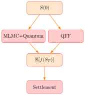

<table>
  <tr>
    <td></td>
    <td style="border-left: 2px solid #ccc; height: 40px;"></td>
    <td></td>
  </tr>
</table>

# JUNCTION QUANTUM HACK 2026
## Quantum Machine Learning for Finance

**Goal:** Implementation of Quantum Algorithm to Speedup Derivative Pricing Beyond Black-Scholes

**Pipeline**

* CLASSICAL: $S(0)$: Prepare the data at time 0 
* Computing the matured distribution:
  - QUANTUM Fast Forwarding:
  - QUANTUM: Non-Fast-Forward Quantum MLMC (Asian option pricing via Quantum Amplitude Estimation + MLMC hierarchy)
* CLASSICAL: Payoff Calculation
* QUANTUM: Greek aware settlement

**Speedups:**
* **Quantum Fast Forwarding**:
* **MLMC+Quantum**:  
* **Greek aware settlement**: Exponential reduction in the number of qubits.

**Future directions**
* Quantum Logic for application of the payout function
* Fully quantum pipeline, Greek aware settlement taking directly state as an input
---

**References:**
- Stamatopoulos et al. (2020): [*Option Pricing using Quantum Computers*](https://doi.org/10.22331/q-2020-07-06-291), Quantum 4, 291
- Wang and Kan (2024): [*Option pricing under stochastic volatility on a quantum computer*](https://doi.org/10.22331/q-2024-10-23-1504), Quantum 8, 1504
- Herman et al. (2026): [*Quantum Speedups for Derivative Pricing Beyond Black-Scholes*](https://arxiv.org/abs/2602.03725), arXiv:2602.03725
- Zoufal et al. (2019): [*Quantum Generative Adversarial Networks for learning and loading random distributions*](https://doi.org/10.1038/s41534-019-0223-2), npj Quantum Information 5, 103